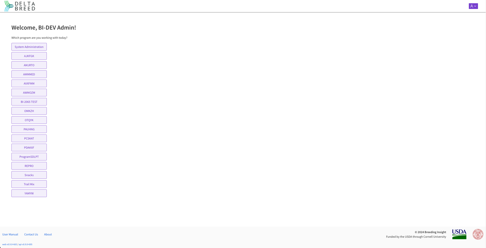
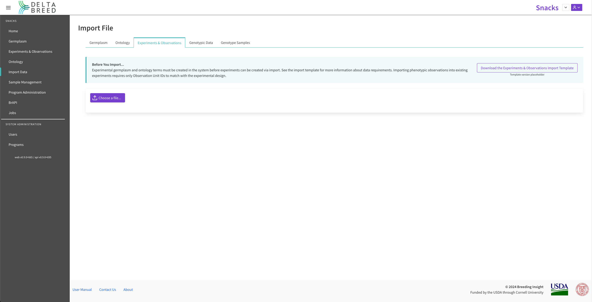
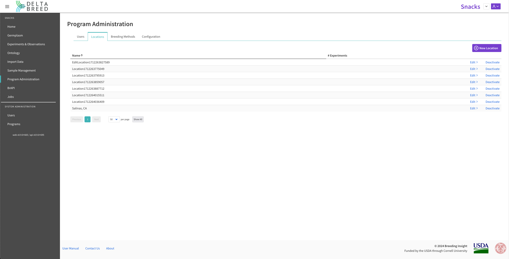

- Home http://localhost:8080/ (*unauthenticated*) 
    - Login modal http://localhost:8080/ 
- Program Selection http://localhost:8080/program-selection 
- Admin: Programs http://localhost:8080/admin/programs 
- Admin: Users http://localhost:8080/admin/users 
- Programs: Home http://localhost:8080/programs/627f5e96-da9b-44f3-9102-d88fd92d4a3e/home 
- Programs: Germplasm http://localhost:8080/programs/627f5e96-da9b-44f3-9102-d88fd92d4a3e/germplasm/germplasm-all 
- Programs: Experiments & Observations http://localhost:8080/programs/627f5e96-da9b-44f3-9102-d88fd92d4a3e/experiments-observations 
- Programs: Ontology
    - Active http://localhost:8080/programs/627f5e96-da9b-44f3-9102-d88fd92d4a3e/ontology/active-terms 
    - Archived http://localhost:8080/programs/627f5e96-da9b-44f3-9102-d88fd92d4a3e/ontology/archived-terms 
- Programs: Import Data
    - Germplasm http://localhost:8080/programs/627f5e96-da9b-44f3-9102-d88fd92d4a3e/import/germplasm 
    - Ontology http://localhost:8080/programs/627f5e96-da9b-44f3-9102-d88fd92d4a3e/import/ontology 
    - Experiments & Observations http://localhost:8080/programs/627f5e96-da9b-44f3-9102-d88fd92d4a3e/import/experiment 
    - Genotypic Data http://localhost:8080/programs/627f5e96-da9b-44f3-9102-d88fd92d4a3e/import/geno 
    - Genotype Samples http://localhost:8080/programs/627f5e96-da9b-44f3-9102-d88fd92d4a3e/import/sample 
- Programs: Sample Management  
- Programs: Program Administration
    -  Users http://localhost:8080/programs/627f5e96-da9b-44f3-9102-d88fd92d4a3e/program-administration/users 
    -  Locations http://localhost:8080/programs/627f5e96-da9b-44f3-9102-d88fd92d4a3e/program-administration/locations 
    -  Breeding Methods http://localhost:8080/programs/627f5e96-da9b-44f3-9102-d88fd92d4a3e/program-administration/breeding-methods 
    -  Configure http://localhost:8080/programs/627f5e96-da9b-44f3-9102-d88fd92d4a3e/program-administration/configuration 
- Programs: BrAPI http://localhost:8080/programs/627f5e96-da9b-44f3-9102-d88fd92d4a3e/brapi 
- Programs: Jobs http://localhost:8080/programs/627f5e96-da9b-44f3-9102-d88fd92d4a3e/jobs 
